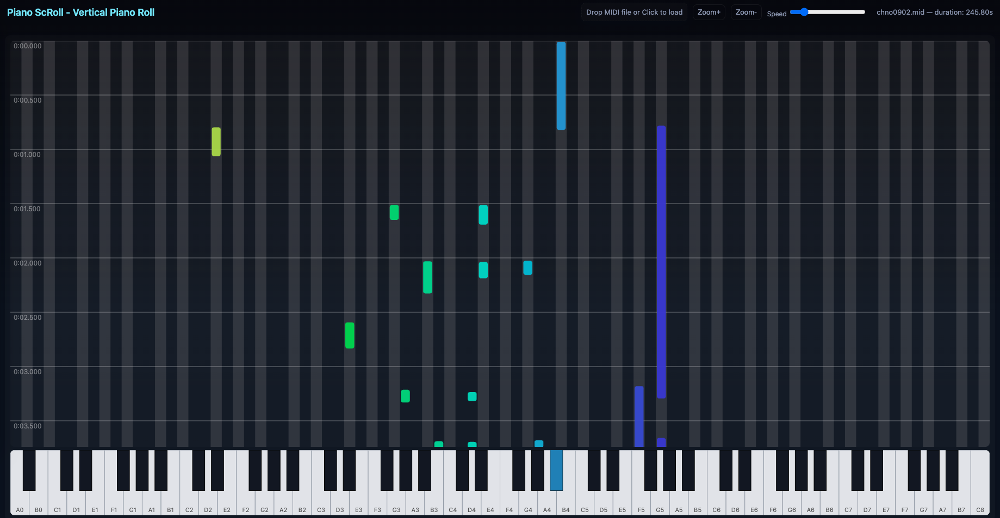

# Piano ScRoll - Vertical Piano Roll

## Description

I wanted a tool that can visualize MIDI files in a piano roll fashion but vertically, showing the keys that are being played at each moment. So I started making this using ChatGPT. I want to use that for learning more songs on the piano as I am not a big fan of conventional sheet notation and after years of struggle I don't feel bad about it anymore.

You can load a MIDI file from the top and visualize it. The file loading happens on the client side, this means no MIDI date is uploaded to the website, it's all done on your computer (in case you care).

You can see a demo [here](gotsopoulos.com/PianoScRoll/).
## Image

## Implementation
This was made mostly using Chat-GPT, proper prompt crafting and then minor changes for sake of functionality. The LLM was going wrong and crazy at times but I needed to provide concise instructions and focus on specific parts of the code that were wrong, such as the piano visualization sucked at first.